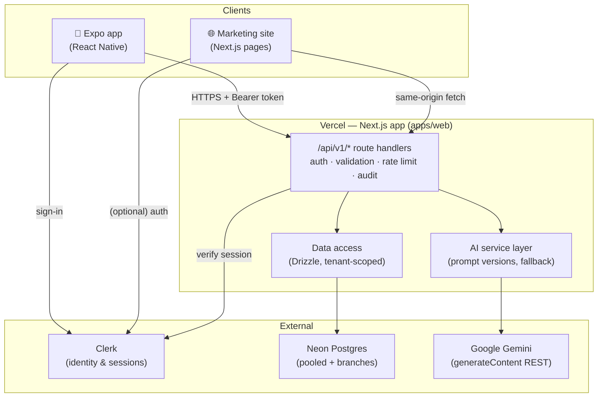
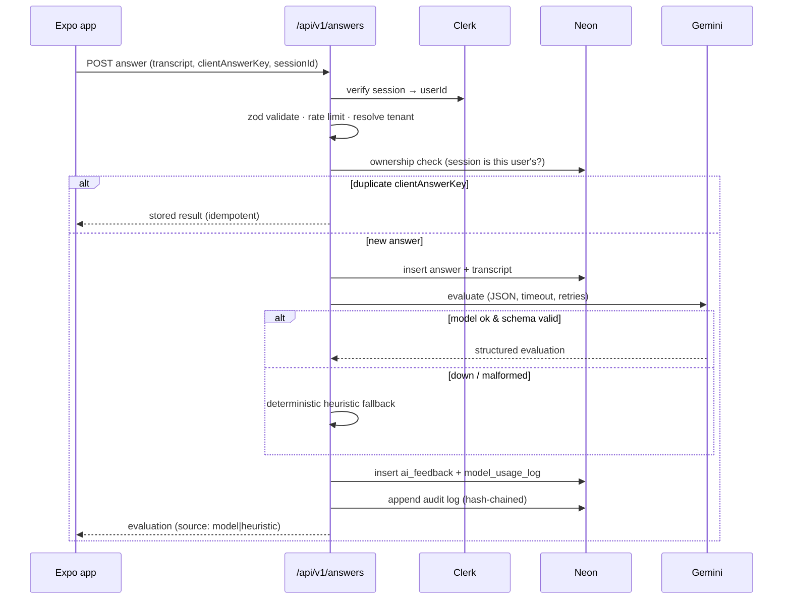
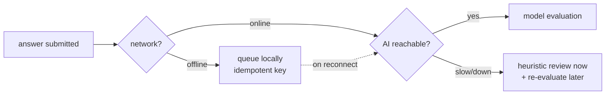

# Architecture

VivaVoce is a two-client product (Expo app + marketing site) over one TypeScript
backend, Neon Postgres, Clerk, and Gemini. See the rationale in
[ADR-0001](adr/0001-architecture.md).

## System context

## Request lifecycle — evaluating a spoken answer

## Degraded-mode behaviour

## Module boundaries (apps/web)

| Layer            | Path                       | Responsibility                          |
| ---------------- | -------------------------- | --------------------------------------- |
| Route handlers   | `src/app/api/v1/*`         | HTTP, auth, validation, rate limit      |
| Auth context     | `src/lib/auth`             | Clerk → domain user + tenant resolution |
| AI service       | `src/lib/ai`               | prompts, client, schemas, fallback      |
| Data access      | `src/lib/db`               | Drizzle schema + tenant-scoped repos    |
| Security         | `src/lib/security`         | rate limit, hashing, redaction, audit   |
| Validation       | `src/lib/validation`       | shared Zod contracts                    |
| Site UI          | `src/app/(marketing)`, `src/components` | marketing pages + components |

## Key cross-cutting invariants

1. **Every user-scoped query carries `tenantId` + ownership** (ADR-0003).
2. **Every external boundary is Zod-validated.** Client input is never trusted.
3. **The AI call site is isolated** so evaluation can move to a queue later
   without touching callers (ADR-0002).
4. **No secrets or PII/audio content in logs** — `redact()` before logging.
