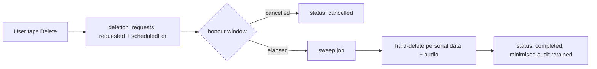

# Privacy, data governance & compliance readiness

VivaVoce processes voice — a sensitive personal data class — so privacy is a
design constraint, not an afterthought. **We make no certification claims.** This
document records the controls that make future compliance (GDPR/CCPA, and student
/ education data norms) achievable.

> **Not an examiner.** VivaVoce is educational coaching. Its scores are not
> official grades or predictions and must not be used for formal assessment. This
> is stated in-product and in the [Terms](../apps/web/src/app/(marketing)/terms/page.tsx).

## Data classification

| Class | Examples | Handling |
| ----- | -------- | -------- |
| **Sensitive** | Voice recordings, transcripts | Opt-in retention; isolated per tenant; encrypted in transit/at rest; never in logs; never used to train others' models |
| **PII** | Email, display name | Minimised; auth via Clerk; maskable in logs |
| **Derived** | Scores, weak areas, analytics | Tied to account; deleted with account |
| **Operational** | Hashed IP, audit, usage logs | Pseudonymised (salted hash); retained for security/integrity |

## Data minimisation

- Only the transcript (bounded) + minimal context is sent to Gemini — no name,
  email, or identifiers attached.
- Raw IPs are never stored — only salted hashes for abuse analysis.
- Audio is referenced by storage key, not duplicated into the database.

## Consent

Captured explicitly at onboarding (audio processing, AI evaluation) and recorded
in `consents` with the policy version and a hashed IP. Retention is a separate,
revocable toggle in Settings. Withdrawing consent stops the related processing.

## Retention schedule (default)

| Data | Retention |
| ---- | --------- |
| Audio recordings | Deleted after transcription unless retention opted in |
| Transcripts & feedback | While account active |
| Analytics rollups | While account active |
| Audit logs | Retained (minimised) for security & integrity |
| Waitlist leads | Until invited or unsubscribed |

## Subject rights (DSAR)

- **Access / export** — Settings → Export pulls everything tied to the account.
- **Rectification** — profile is editable.
- **Erasure** — Settings → Delete files a `deletion_requests` row with a
  `scheduledFor` honour window; a sweep hard-deletes personal data and any
  retained audio, leaving only minimised audit records. See the runbook.
- **Restriction / objection** — revoke audio retention or AI consent in Settings.

## Deletion / right-to-be-forgotten flow

## Children / education data

VivaVoce targets higher-education and adult learners. We require users to meet
the age of consent for data processing in their jurisdiction. If an
institutional (org) tier is introduced, org admins manage membership but **never
have access to raw audio**.

## Processors

Clerk (identity), Neon (database), Vercel (hosting), Google Gemini (AI). Each is
a sub-processor; data sent is minimised and environment-segregated. Maintain a
processor register and DPAs before any production launch handling real user data.
