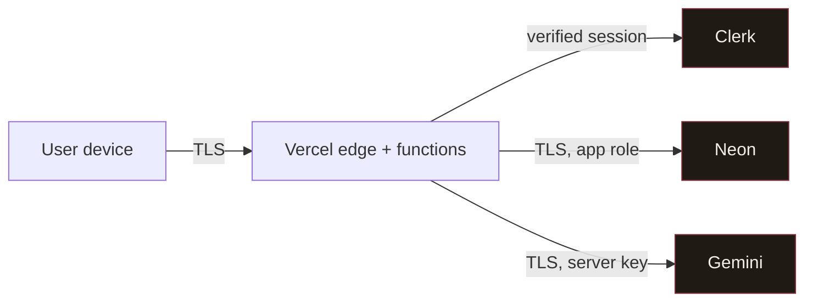

# Security

Security posture for VivaVoce. Vulnerability reporting: [SECURITY.md](../SECURITY.md)
(root). Threat scenarios: [THREAT-MODEL.md](THREAT-MODEL.md).

## Trust boundaries

Everything left of Vercel is **untrusted**. The only secrets are server-side
(Clerk secret key, Gemini key, DB URLs); the mobile app holds only a *publishable*
Clerk key and short-lived session tokens in the OS secure store.

## Controls (and where they live)

| Area | Control | Where |
| ---- | ------- | ----- |
| Input | Zod validation on every boundary; length caps on transcripts | `lib/validation`, `lib/http` |
| AuthN | Clerk sessions; server verifies, never trusts client identity | `lib/auth`, `middleware.ts` |
| AuthZ | Ownership + tenant check on every user-scoped query | `lib/db/*.repo.ts` |
| Tenant isolation | App-layer scoping + Postgres RLS + least-priv role | ADR-0003, `scripts/apply-rls.ts` |
| SQL injection | Parameterised queries only (Drizzle); no string SQL | `lib/db` |
| Rate limiting | Sliding window per IP/user per surface | `lib/security/ratelimit.ts` |
| Brute force | Handled by Clerk; our auth endpoints are Clerk-hosted | Clerk |
| Secrets | Env-validated at boot; never logged; not `NEXT_PUBLIC_` | `lib/env.ts` |
| Transport | HTTPS everywhere; HSTS preload | `next.config.ts` |
| Headers/CSP | Strict CSP, `nosniff`, `frame-ancestors none`, Permissions-Policy | `next.config.ts` |
| Secure errors | Terse client errors + `requestId`; no stack traces | `lib/http.ts` |
| PII in logs | `redact()` masks emails/tokens/transcripts/audio | `lib/security/redact.ts` |
| Audit trail | Append-only, hash-chained (tamper-evident) | `lib/security/audit.ts` |
| Prompt injection | Transcript framed as data; model told to ignore embedded instructions; inputs bounded | `lib/ai/prompts.ts` |
| Mobile storage | Session tokens in `expo-secure-store` (Keychain/Keystore) | `lib/token-cache.ts` |
| Dependencies | `npm audit --omit=dev --audit-level=high` in CI | `.github/workflows/ci.yml` |

## Content Security Policy

`default-src 'self'`; scripts limited to self + Clerk + Vercel Analytics
(`'unsafe-eval'` only in development for React's dev build); `connect-src`
allow-lists Clerk, Neon, and the Gemini REST endpoint; `frame-ancestors 'none'`;
`object-src 'none'`; `upgrade-insecure-requests`. Defined in
[`next.config.ts`](../apps/web/next.config.ts).

## Secure audio & transcript handling

- Audio is **referenced, never inlined** in the DB (`answers.audioStorageKey`).
- Retention is opt-in; default is delete-after-transcription.
- Transcripts are bounded (6000 chars) before any model call.
- Both are isolated per tenant and excluded from logs.

## Tamper-evident audit log

Each `audit_logs` row stores `entryHash = sha256(prevHash + canonical(payload))`.
A break in the chain reveals insertion, deletion, or mutation. A periodic verifier
(ops job) walks the chain and alerts on a mismatch.

## Environment segregation

`development` (local + Neon dev branch), `preview` (Vercel preview + Neon branch
per PR), `production` (separate Neon project/branch, separate Clerk instance,
separate Gemini key). Secrets are per-environment in Vercel; none in the repo.

## Least privilege (database)

Runtime connects as `vivavoce_app` (DML only — no DDL, cannot disable RLS).
Migrations use the owner role over a direct connection. See `scripts/apply-rls.ts`.

## Security checklist (per release)

- [ ] New endpoints validate input with Zod and check ownership + tenant.
- [ ] No secret/PII/audio reaches logs (`redact()` applied).
- [ ] Rate limits set for any new abusable surface.
- [ ] `npm audit --omit=dev --audit-level=high` clean.
- [ ] CSP/`connect-src` updated if a new external origin was added.
- [ ] Migrations reviewed; RLS still covers any new tenant table.
- [ ] Secrets present per-environment; none committed.
