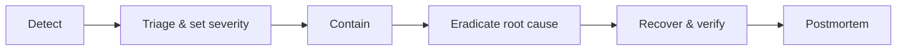

# Incident response (starter)

A lightweight process for a small team. Optimise for containment and honest
communication over ceremony.

## Severity

| Sev | Definition | Examples | Target response |
| --- | ---------- | -------- | --------------- |
| **SEV1** | Confidentiality breach or full outage | Cross-tenant data exposure, auth bypass, DB down | Immediate |
| **SEV2** | Major degradation, no data loss | API errors > 25%, evaluation broadly failing | < 1 hour |
| **SEV3** | Minor / contained | Single feature degraded, AI fallback active | Next business day |

## Roles

For a solo/small team the responder is also the comms lead. As the team grows:
**Incident Commander** (coordinates), **Ops** (mitigates), **Comms** (updates
users/stakeholders).

## Flow

1. **Detect** — alert, user report, or anomaly (usage spikes, audit-chain break).
2. **Triage** — assign severity; open an incident note (timeline, impact, actions).
3. **Contain** — stop the bleeding: rotate a leaked secret, disable an endpoint,
   block an abusive key, roll back a bad deploy (`vercel rollback`).
4. **Eradicate** — fix the root cause; add a regression test.
5. **Recover** — redeploy; verify `/api/v1/health` and a smoke flow; watch metrics.
6. **Postmortem** — within a week: what happened, why, what we change. Blameless.

## Specific playbooks

- **Suspected cross-tenant leak (SEV1)**: freeze the suspect endpoint; review the
  query for a missing tenant/ownership filter; confirm RLS coverage; assess scope
  via audit logs; notify affected users per policy; add a test reproducing the gap.
- **Audit-chain mismatch (SEV1)**: preserve the DB state (Neon branch snapshot);
  determine the altered range; investigate access; treat as potential intrusion.
- **Credential stuffing (SEV2)**: Clerk handles lockout/MFA — raise protections in
  Clerk; correlate with auth-failure anomalies; consider temporary sign-up review.
- **AI provider outage (SEV3)**: no action needed for users (heuristic fallback);
  monitor `model_usage_logs`; post a status note if prolonged.

## Communication

Be specific and timely: what's affected, what users should do, when the next
update lands. For data incidents, follow the breach-notification obligations
referenced in [COMPLIANCE.md](../COMPLIANCE.md).
